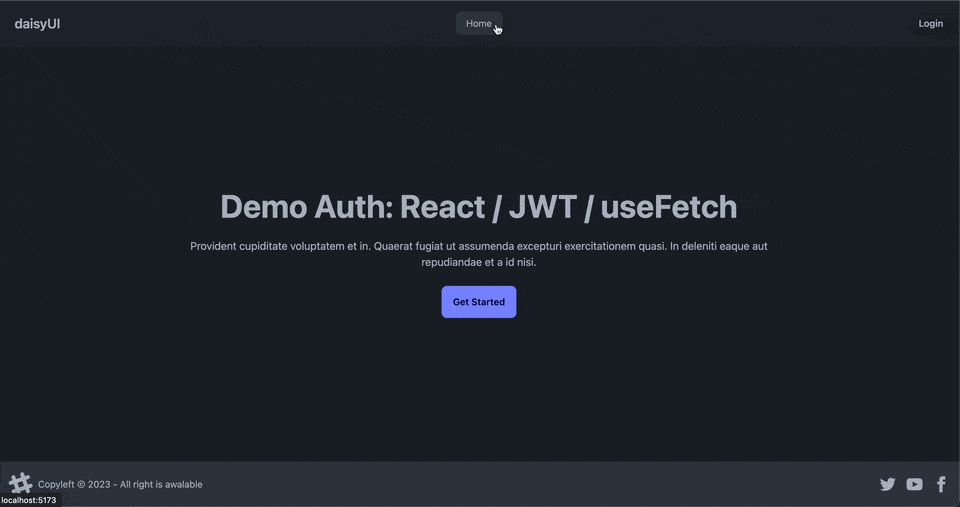

# Demo: React / JWT tokens / useFetch

This is a simple example of implementing JWT tokens on client side for user authorization.

Also using in this repository:
- [zod](https://zod.dev)
- [react-hook-form](https://react-hook-form.com)
- [react-router](https://reactrouter.com/en/main)
- [axios](https://axios-http.com)
- [react-jwt](https://github.com/gustavo0197/react-jwt#readme)
- [localforage](https://github.com/localForage/localForage)
- [clsx](https://github.com/lukeed/clsx)
- [daisy.ui](https://daisyui.com)





## 🚀 Quick start

start dev server & tailwind for development

```bash
yarn dev_concorent
# the command above will launch next:
yarn dev
yarn tailwind
```

start by container

```bash
docker-compose up
```

You can can alse using [demo_auth_drf_jwt](https://github.com/V-U-Simon/demo_auth_drf_jwt) repository for backend for authentication.